<div align="center">



<a href="https://github.com/frohdbek">
  
</a>

<br/>


</div>

---

## `$ whoami`

```bash
name       = "Muhammed Yavuz Açıkmeşe"
role       = "Computer Engineering @ Recep Tayyip Erdoğan University"
focus      = ["Linux systems", "Network security", "Software architecture"]
location   = "Rize, TR"
status     = "always learning"
```

## `$ ls ~/projects`

| Project | Description | Stack |
|---|---|---|
| 🖥️ [homelab-server-setup](https://github.com/frohdbek/homelab-server-setup) | Self-hosted NAS and dev server on Raspberry Pi Zero 2 W | `Linux` `SSH` `Samba` |
| 📻 [GreenWire-FM](https://github.com/frohdbek/GreenWire-FM) | Low-cost Raspberry Pi FM transmitter | `Shell` `Raspberry Pi` |
| 📈 [trendsai](https://trendsai.com.tr/) | AI-powered web app that analyzes Google Trends data | `Python` `AI` |
| 🔗 [Zincir-app](https://github.com/frohdbek/Zincir-app) | Daily streak tracker, each task keeps its own streak | `HTML` |
| 🪙 [live_gold](https://github.com/frohdbek/live_gold) | Telegram bot for real-time gold prices | `Python` |

## `$ cat skills.txt`

<div align="center">


</div>

## `$ git stats`

<div align="center">


</div>

## `$ ./activity --graph`

<div align="center">


</div>

## `$ contact --all`

<div align="center">

[](mailto:acikmesey@gmail.com)
[](https://www.linkedin.com/in/muhammed-yavuz-a-8607a0227)
[](https://trendsai.com.tr/)

<br/>

```
$ echo "Thanks for stopping by!"
Thanks for stopping by!
```

</div>
